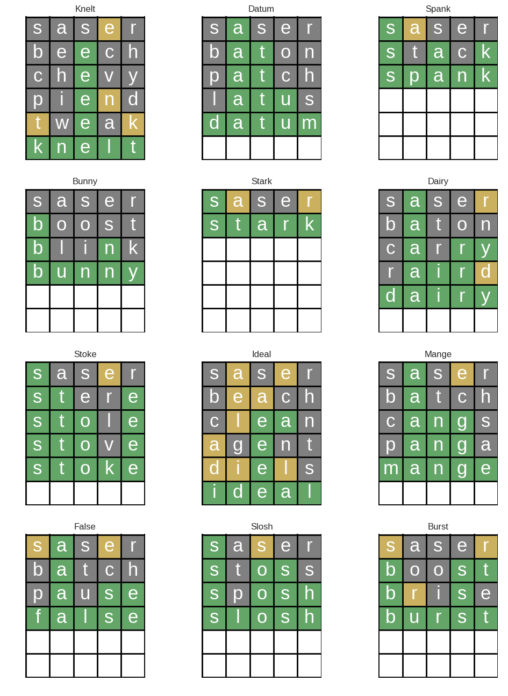
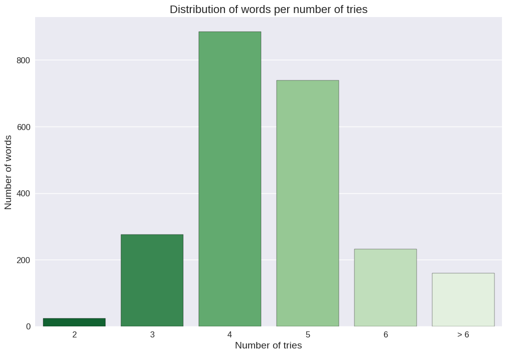
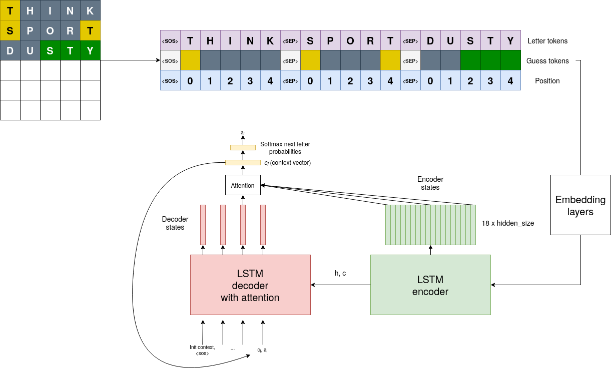
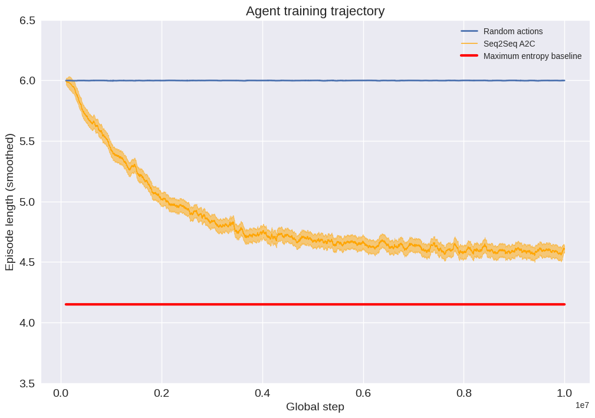

# Playing Wordle with RL

This is a Seq2seq A2C based Wordle solver

--- 
##### Game examples

    

---

The agent is able to solve 93% words out of 2314 possible answers, and most of them are solved for 4 guesses.

    

As the game is limited to accept only 12971 as a try, so our agent is limited to generate a guess based on this set of words.

---

##### Agent architecture

The agent architecture is a vanilla seq2seq with attention. All the letters present in a current game, their colors and positions are represented as a sequence with separators and then embedded.
Based on this, we consequently predict next letter.

Note that we can easily decompose a whole word policy probability into a product of letter conditional probabilities.

$$ \pi \big(a | s \big) = 
\pi \big(a^1 | s \big) 
\pi \big(a^2 | s, a^1 \big)
\dots
\pi \big(a^5 | s, a^4, a^3, a^2, a^1 \big) $$

And the architecture looks as follows:

    

##### Training: mean episode length

Mean episode length is more illustrative that reward progress.
And we also can see how it is compared with a simple maximum entropy heuristic by 3b1b (~4.15 episode length).
The agent performs a bit worse (as you see on a picture in the beginning, saser is hardly an optimal opening word), but it still looks pretty good!

    

#####